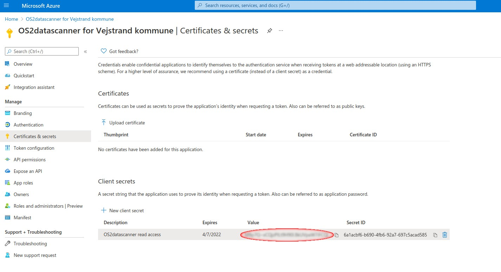
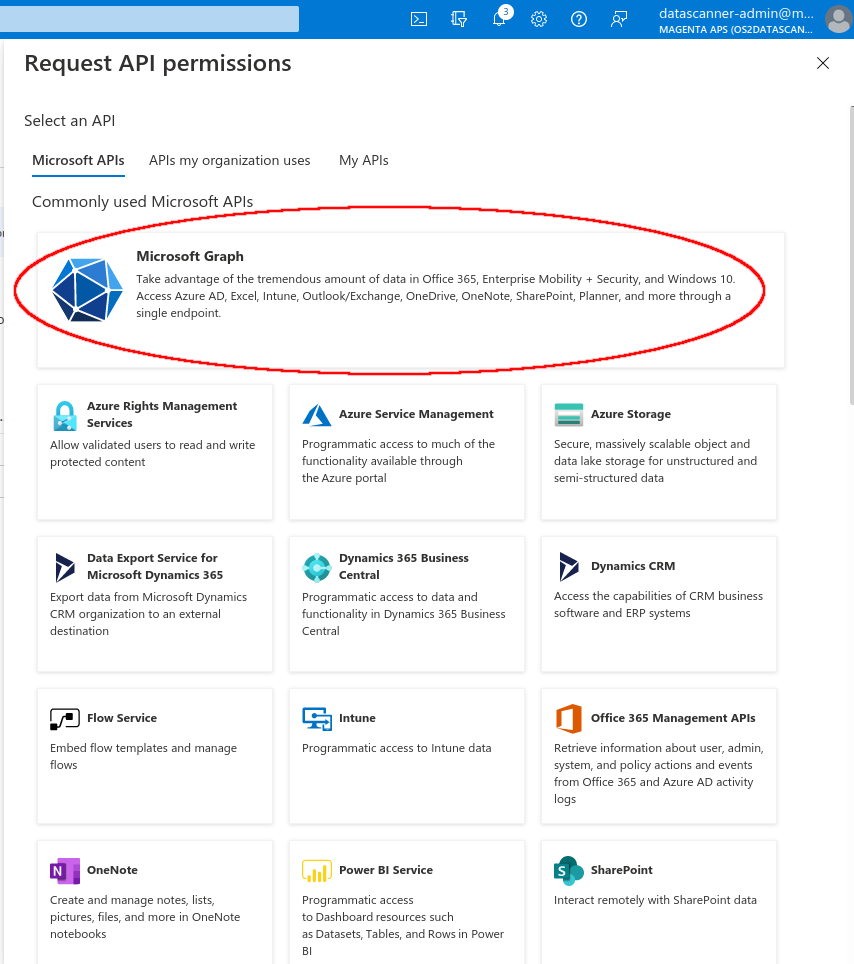
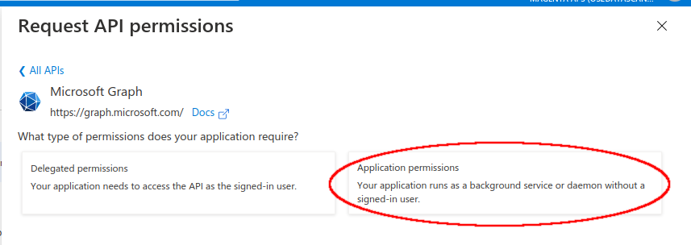
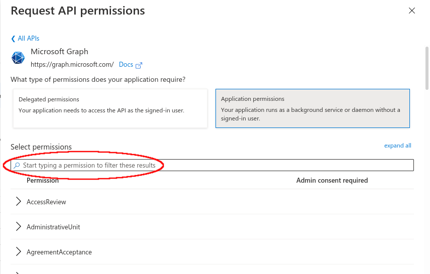

# Scanning af Office 365 med Microsoft Azure

Denne dokumentation beskriver, hvorledes *OS2datascanner* kan anvendes til at scanne filer og mails fra Microsoft Office 365.
Først beskrives den påkrævede opsætning af Applikationsregistrering i  Microsoft Azure's portal.
Herefter demonstreres der, hvorledes et scan af mails fra Office 365 oprettes i *OS2datascanner*.

Gennem denne guide anvendes Vejstrand Kommune som eksempel. 
Udskift derfor tekster, såsom "Vejstrand" og "<DIN_KOMMUNES_NAVN>", med navnet på den pågældende kommune.

## Del 1: Opsætning af Applikation i Azure

For at kunne scanne filer og mails fra Office 365 med *OS2datascanner*, så skal der først registreres en Azure Applikation
for at give tilladelse til at hente data fra Office 365. Denne del af vejledningen viser, hvordan man, trin-for-trin, registrerer
en Azure Applikation.

*Step 1:* Log ind på Microsoft Azure's portal via. [https://portal.azure.com/#home](https://portal.azure.com/#home).
	Vælg nu: "Azure Active Directory".

*Step 2:* Fra Azure Active Directory menuen i venstre side skal du vælge "App Registration".

*Step 3:* Klik på "New registration".

*Step 4:* Indtast et sigende navn for applikationen i inputfeltet "Name". 
	Et sigende navn kunne eksempelvis være "OS2datascanner for <DIN_KOMMUNES_NAVN> kommune".
	Vælg nu "Accounts in this organizational directory only (Single tenant)" under "Supported account types".
	Indtast følgende i inputfeltet for "Redirect URI": `https://<DIN_KOMMUNES_NAVN>-admin.os2datascanner.dk/msgraph-mailscanners/add/`

*Step 5:* Når ovenstående er udfyldt, så skal du klikke på "Register".
	Nu har du registreret en ny app, og du skulle gerne se en oversigt over den nye app.

*Step 5½ (Valgfri):* Hvis der også ønskes at scanne filer fra OneDrive skal der tilføjes en Redirect URI mere.
	Det gøres ved at klikke på menu punktet i venstre side kaldet "Authentication".
	Klik herefter på "Add URI" og indsæt følgende redirect URI: `https://<DIN_KOMMUNES_NAVN>-admin.os2datascanner.dk/msgraph-filescanners/add/`.
	Tryk på "Save".

Klik nu på "Overview" i menuen til venstre for at komme tilbage til oversigten for applikationen.

*Step 6:* Kopiér nu "Application (client) ID" og send dette til Magenta ApS.

*Step 7:* For at OS2datascanner kan scanne emails og filer i Azure via. den oprettede Applikation, så skal der genereres en Client secret. 
	Det gøres via. menupunktet "Certificates & secrets" i menuen til venstre.

*Step 8:* Klik nu på "New client secret".
	Indtast et beskrivende navn for denne "client secret" i inputfeltet "Description".
	Sæt en fornuftig udløbsdato. Det anbefales, at udløbsdatoen ikke er længere fremme end 6 måneder af sikkerhedsmæssige årsager.
	Klik på "Add". 
	Notér udløbsdatoen og send den til Magenta ApS.

*Step 9:* Kopier nu "Value" for den genererede client secret (markeret på billedet med rød cirkel ovenfor) ved at klikke på Kopier ikonet lige ved siden af. 
	Denne værdi kan kun ses lige efter oprettelse, så derfor er det vigtigt at værdien gemmes et sikkert sted.
	Send en kopi af "Value" for client secret til Magenta ApS.
	BEMÆRK: Det er meget vigtig, at denne client secret opbevares sikkert og utilgængeligt for uvedkommende.

*Step 10:* Endeligt, så skal applikationen have tildelt såkaldte API rettigheder. Disse styrer præcis, hvilke data, som *OS2datascanner* har adgang til at scanne.
	Klik på menupunktet "API permissions" i menuen til venstre og dernæst på "Add a permission".

*Step 11:* Der vil nu dukke en menu op i højre side af skærmen.
	Klik på "Microsoft Graph" menuen.

*Step 12:* Klik på menupunktet "Application permissions".

*Step 13:* Her skal der findes og tilføjes følgende permissions:

* Directory.Read.All
* Files.Read.All
* Mail.Read
* Notes.Read.All
* Sites.Read.All
* User.Read

Brug eventuelt søgefeltet, som er markeret på nedestående billede, til at søge i permissions.

Når alle permissions er fundet og tilføjet skal det se ud som på billedet herunder.

Når Magenta ApS har tilføjet det tilsendte Client Secret og Application ID til jeres OS2datascanner installation kan der tilføjes og igangsættes Office365 scannerjobs.

Du har nu gennemført del 1 af denne guide til opsætning af Microsoft Azure til scanning af Office 365 med *OS2datascanner*.

## Del 2: Oprettelse af Office 365 scannerjobs

I del 2 tages der udgangspunkt i oprettelsen af et scannerjob med *OS2datascanner*s "Office 365 mailscanner".
Dette forudsætter, at der er opsat en Azure Applikation som beskrevet i del 1 i denne guide.
Det er også muligt at oprette et scan af filer fra Office 365 OneDrive. 
Fremgangsmåden for "Office 365 mailscanner" og "Office 365 OneDrive filscanner" er identiske.

*OS2datascanner* gør det bl.a. muligt at scanne mails i Office 365 email konti. Hvis fanen "Office 365 mailscanner" er synlig, er det muligt at tilføje et nyt scannerjob.

*Step 1:* Klik på "Office 365 mailscanner" fanebladet.
	Klik herefter på "Tilføj scannerjob" knappen.

*Step 2:* Hvis der ikke er oprettet andre Office 365 scannerjobs skal du via Microsoft Online (Office 365) give OS2datascanner lov til at tilgå organisationens data. Dette gøres ved at klikke på "Fortsæt til Microsoft Online" knappen.

*Step 3:* Du vil nu blive bedt om at logge ind via Microsoft online. Hvis ikke din Microsoft bruger
allerede er logget ind vil du blive om at indtaste password. Brugeren, som du logger ind med, skal have de fornødne rettigheder til [den pågældende Microsoft Azure Applikation](https://docs.microsoft.com/en-us/azure/active-directory/manage-apps/what-is-application-management).

*Step 4:* Efterfølgende skal du acceptere at tredjeparts applikationen *OS2datascanner* får læseadgang til kilder der skal scannes (Se nedestående billede).

Herefter vil du blive ført tilbage til *OS2datascanner*s administrationsmodul, hvor du nu kan færdiggøre oprettelsen af dit scannerjob (Se venligst implementeringshåndbogen).

Du har nu gennemført del 2 af denne guide til oprettelse af et "Office 365 mailscanner"-job i *OS2datascanner*.
