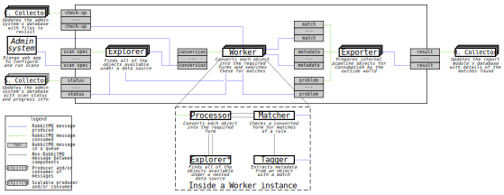

# OS2Datascanner

Welcome to the **technical documentation** for
[OS2Datascanner](https://os2datascanner.magenta.dk/en/). For more about the
product, please visit
[https://os2datascanner.dk](https://os2datascanner.magenta.dk/en/).

## System overview

An OS2Datascanner installation consists of three components: the
*administration interface* (a Django app), the *scanner engine* (a set of
system services), and the *report interface* (another Django app).

The administration interface is used to build up scanner jobs: sources of
scannable things and rules to search for in them. The details of these jobs are
stored in a PostgreSQL database. It's intended for use by an organisation's
administrators or data protection officers.

The scanner engine, also known as the *pipeline*, consists of five *stages*
built around RabbitMQ message queues. Each of these stages is a program that
reads a message, carries out a small, simple job, and then sends one or more
messages to another stage. At a high level, the scanner engine receives scan
requests from the administration interface and produces scan results.

The report interface displays the results of the scanner engine. It shows
matched objects and details of why they were matched, and allows users to flag
certain results as irrelevant. It's intended for use by all of an
organisation's employees.

